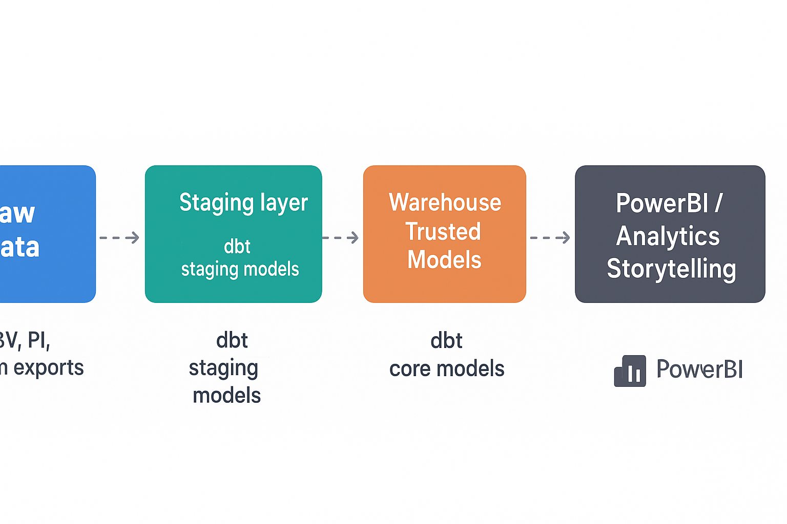

  
  
  

<h1 align="center">🛍️ Fashion E-commerce Analytics</h1>

  <b>End-to-End Data Analytics Pipeline — Snowflake | dbt | Power BI</b> 
  <i>Modern data stack project for multi-currency global retail analytics</i>

# Fashion E-commerce Analytics – Portfolio Project (Global, Multi-currency)

**Project goal:** Build end-to-end analytics for a global fashion e-commerce DTC brand.

---

## Architecture Overview

_This architecture illustrates the end-to-end analytics flow for a global e-commerce brand.  
Raw sales, marketing, and traffic data are ingested into Snowflake, transformed through dbt staging and core models,  
and visualized in Power BI dashboards to support product, merchandising, and growth decisions._

---

## Data Model & Sources

The dataset simulates a global multi-currency fashion e-commerce brand with the following tables:

| Table                     | Description                                                       |
| ------------------------- | ----------------------------------------------------------------- |
| `orders`                  | Core transaction-level sales data (multi-currency, multi-country) |
| `order_items`             | Line-level order details including SKUs and quantities            |
| `products`                | Product catalog and category hierarchy                            |
| `customers`               | Customer profiles and segmentation fields                         |
| `marketing_spend`         | Paid marketing spend by channel (Meta, Google, TikTok)            |
| `traffic_sessions_sample` | Web traffic sessions and conversion data                          |

All raw data is stored in the **Snowflake warehouse**, modeled via **dbt** into staging and analytics layers.

---

## dbt Models Overview

| Layer     | Description                                           |
| --------- | ----------------------------------------------------- |
| `stg_*`   | Staging models for raw normalization and cleaning     |
| `core_*`  | Core business entities (Orders, Customers, Products)  |
| `marts_*` | Aggregated reporting tables (Revenue, CAC, CLV, ROAS) |

Data transformations are modular, documented, and testable through dbt.

---

## Power BI Dashboards

The reporting layer is built in **Power BI** and includes the following dashboards:

- **Sales & GMV Dashboard** — by country, product category, and currency
- **Customer Analytics** — repeat purchase rate, CLV, churn risk
- **Marketing Performance** — spend efficiency, ROAS, conversion funnel

Each dashboard is powered by the dbt marts and Snowflake datasets.

---

## Tech Stack

- **Warehouse:** Snowflake
- **Transformations:** dbt
- **Visualization:** Power BI
- **Languages:** SQL, Python (EDA notebooks)
- **Version Control:** Git + Git LFS

---

⭐ _This project demonstrates the ability to design, build, and visualize a full analytics pipeline using modern data stack principles._
